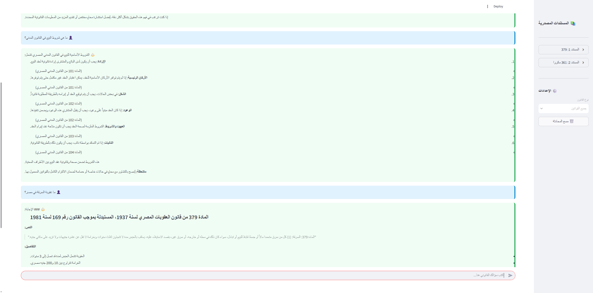

# Al-Muhami Al-Zaki (المحامي الذكي)
## The Intelligent Lawyer — Corrective RAG for Egyptian Law

> "The Lawyer Who Doesn't Lie" — A system that retrieves, grades, and validates legal information before answering.




---

## 🎯 Overview

**Al-Muhami Al-Zaki** is a Corrective RAG (CRAG) system designed for Egyptian legal research. Unlike standard RAG systems that may hallucinate, this system:

1. **Retrieves** relevant legal documents from a vector database
2. **Grades** each document for relevance using a local LLM (Ollama llama3.1:8b)
3. **Validates** that sufficient context exists before answering
4. **Generates** answers with mandatory source citations
5. **Admits ignorance** when information is not available

### Key Features

| Feature | Description |
|---------|-------------|
| 🔍 **Semantic Search** | Multilingual E5-Large embeddings for Arabic legal texts |
| ⚖️ **Corrective Logic** | Document grading prevents hallucination |
| 📖 **Mandatory Citations** | Every answer cites Law Number, Article, Year |
| 🔒 **Privacy Compliant** | CAMeLBERT-NER for PII anonymization (Law 151/2020) |
| 💸 **Zero API Cost** | Fully local with Ollama (optional cloud fallback) |
| 🌐 **RTL Arabic UI** | Streamlit interface designed for Arabic text |

---

## 📊 Performance

### Egyptian Law Benchmark v2 (20 Questions)

| Category | Accuracy | Score |
|----------|----------|-------|
| **Overall** | **60.0%** | 12/20 |
| Civil Code | 🏆 100.0% | 5/5 |
| Personal Status | ⭐ 66.7% | 2/3 |
| Constitution | ⭐ 66.7% | 2/3 |
| Criminal Procedure | ⭐ 50.0% | 1/2 |
| Penal Code | 28.6% | 2/7 |

**Average Latency**: ~23 seconds per query

---

## 🏗️ Architecture

```
┌─────────────────────────────────────────────────────────────────┐
│                        User Question                            │
└─────────────────────────────────┬───────────────────────────────┘
                                  │
                                  ▼
┌─────────────────────────────────────────────────────────────────┐
│                         RETRIEVE                                │
│              Qdrant Vector Search (E5-Large)                    │
└─────────────────────────────────┬───────────────────────────────┘
                                  │
                                  ▼
┌─────────────────────────────────────────────────────────────────┐
│                          GRADE                                  │
│              Ollama (llama3.1:8b) - Relevance Scoring           │
└─────────────────────────────────┬───────────────────────────────┘
                                  │
                    ┌─────────────┼─────────────┐
                    │             │             │
                    ▼             ▼             ▼
              ┌──────────┐  ┌──────────┐  ┌──────────┐
              │ GENERATE │  │ REWRITE  │  │NO ANSWER │
              │ (Ollama) │  │ (Retry)  │  │  (Admit) │
              └──────────┘  └──────────┘  └──────────┘
```

### CRAG Flow

1. **Retrieve**: Query Qdrant for top-5 similar legal chunks
2. **Grade**: LLM evaluates relevance of each chunk (binary: relevant/irrelevant)
3. **Route**: 
   - If relevant docs found → Generate answer
   - If no relevant docs → Rewrite query and retry (max 2 attempts)
   - If max retries reached → Admit "I don't know"
4. **Generate**: Synthesize answer with mandatory citations

---

## 🚀 Quick Start

### Prerequisites

- Python 3.10+
- [Ollama](https://ollama.ai/) installed and running
- GPU recommended (RTX 3060 or better for embeddings)

### 1. Clone & Install

```bash
git clone https://github.com/moazmo/Al-Muhami-Al-Zaki.git
cd Al-Muhami-Al-Zaki

# Create virtual environment
python -m venv venv
source venv/bin/activate  # Windows: .\venv\Scripts\Activate

# Install dependencies
pip install -r requirements.txt
```

### 2. Download Ollama Models

```bash
# Start Ollama (in separate terminal)
ollama serve

# Pull required models
ollama pull llama3.1:8b   # Grader
ollama pull qwen2.5:7b    # Generator
```

### 3. Configure Environment

```bash
cp .env.example .env
# Edit .env with your Qdrant Cloud credentials
```

### 4. Ingest Legal Documents

```bash
python scripts/ingest_laws.py \
    --input data/raw/civil_code.pdf \
    --source-name "القانون المدني المصري" \
    --source-type law \
    --law-year 1948 \
    --skip-anonymization
```

### 5. Run the Application

```bash
streamlit run app.py
```

---

## 📁 Project Structure

```
Al-Muhami-Al-Zaki/
├── src/
│   ├── ingest/               # Data Engineering (ETL)
│   │   ├── loader.py         # PDF/TXT/DOCX loading
│   │   ├── anonymizer.py     # PII masking (Law 151)
│   │   ├── chunker.py        # Arabic-aware legal splitting
│   │   └── embedder.py       # E5 embedding + Qdrant upload
│   │
│   ├── graph/                # CRAG State Machine
│   │   ├── state.py          # GraphState TypedDict
│   │   ├── nodes.py          # retrieve, grade, generate, rewrite
│   │   ├── edges.py          # Conditional routing
│   │   └── builder.py        # LangGraph compilation
│   │
│   ├── prompts/              # LLM System Prompts
│   │   ├── grader.py         # Binary relevance grader
│   │   ├── generator.py      # Citation-aware generator
│   │   └── rewriter.py       # Query reformulator
│   │
│   └── clients/              # API Clients
│       ├── gemini_client.py  # Google Gemini (fallback)
│       └── groq_client.py    # Groq/Llama (fallback)
│
├── scripts/
│   ├── ingest_laws.py        # Document ingestion CLI
│   ├── benchmark_egyptian.py # Custom benchmark runner
│   ├── test_crag.py          # Single query tester
│   └── analyze_qdrant.py     # Database analyzer
│
├── data/
│   ├── raw/                  # Source PDFs
│   └── eval/                 # Benchmark files & results
│
├── app.py                    # Streamlit UI
├── requirements.txt          # Dependencies
└── docs/ANALYSIS.md          # Technical analysis
```

---

## 🔒 Privacy & Compliance

This system is designed for **Egypt Data Protection Law 151/2020** compliance:

- **Anonymization Pipeline**: Names, locations, and organizations are masked using CAMeLBERT-NER
- **Audit Trail**: Every anonymization is logged for compliance review
- **No Permanent Storage**: User queries are not persisted

### Anonymization Example

```
Input:  "حكم ضد أحمد علي المقيم في القاهرة"
Output: "حكم ضد [شخص] المقيم في [مكان]"
```

---

## 📊 Evaluation

### Run Custom Benchmark

```bash
python scripts/benchmark_egyptian.py
```

### Test Single Query

```bash
python scripts/test_crag.py --query "ما هي عقوبة السرقة؟"
```

### Analyze Qdrant Database

```bash
python scripts/analyze_qdrant.py
```

---

## 🛠️ Tech Stack

| Component | Technology | Purpose |
|-----------|------------|---------|
| **Orchestration** | LangGraph | Cyclic state machine CRAG |
| **Vector DB** | Qdrant Cloud | Semantic search, ~1900 vectors |
| **Embeddings** | multilingual-e5-large | Arabic-optimized, GPU-accelerated |
| **Grader LLM** | Ollama (llama3.1:8b) | Local, fast relevance scoring |
| **Generator LLM** | Ollama (qwen2.5:7b) | Local, unlimited generation |
| **UI** | Streamlit | RTL Arabic support |
| **Arabic NLP** | CAMeLBERT-NER | PII detection for Law 151 |

---

## ⚙️ Environment Variables

```env
# Qdrant Cloud (Required)
QDRANT_URL=https://xxx.cloud.qdrant.io:6333
QDRANT_API_KEY=xxx
QDRANT_COLLECTION_NAME=egyptian_law

# Models (Ollama - Local)
GRADER_MODEL=llama3.1:8b
GENERATOR_MODEL=qwen2.5:7b
EMBEDDING_MODEL=intfloat/multilingual-e5-large

# Optional (Cloud Fallback)
GROQ_API_KEY=xxx
GOOGLE_API_KEY=xxx
```

---

## 🤝 Contributing

1. Fork the repository
2. Create a feature branch (`git checkout -b feature/amazing-feature`)
3. Commit changes (`git commit -m 'Add amazing feature'`)
4. Push to branch (`git push origin feature/amazing-feature`)
5. Open a Pull Request

---

## 📜 License

MIT License — See [LICENSE](LICENSE) for details.

---

## 👤 Author

**moazmo**
- GitHub: [@moazmo](https://github.com/moazmo)
- Email: moazmo27@gmail.com

---

<div align="center">
  <strong>🏛️ Building the future of Justice in Egypt. Accuracy is Law. 🏛️</strong>
</div>
